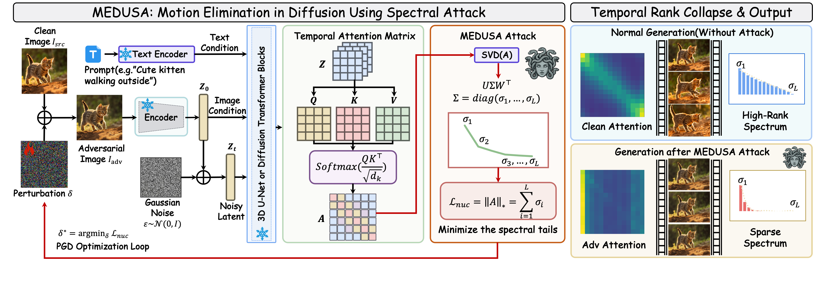
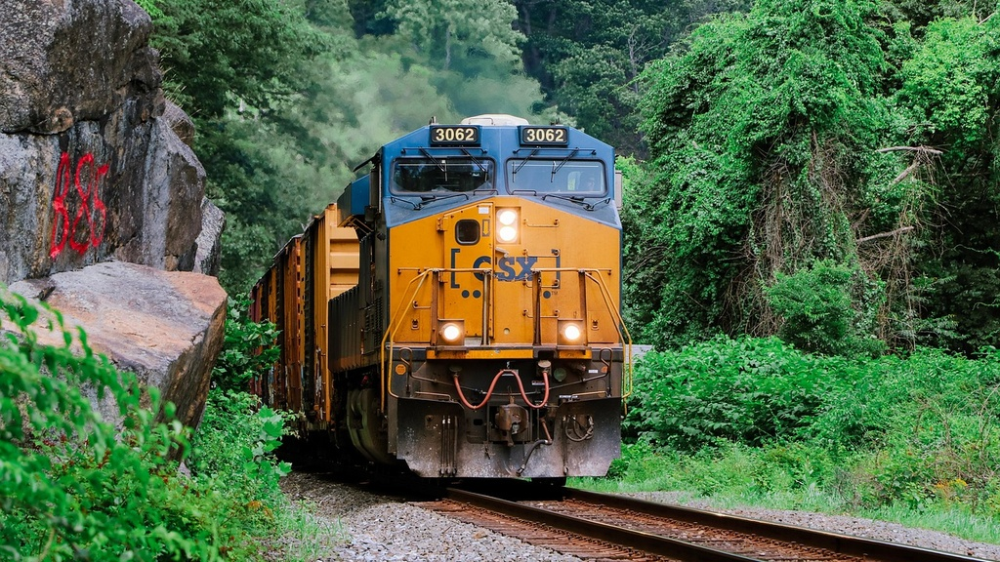
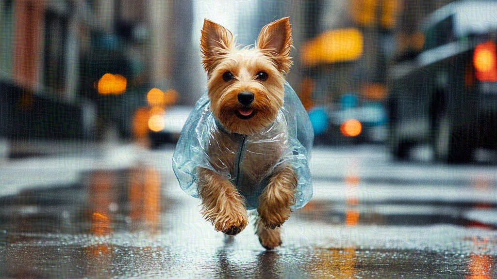
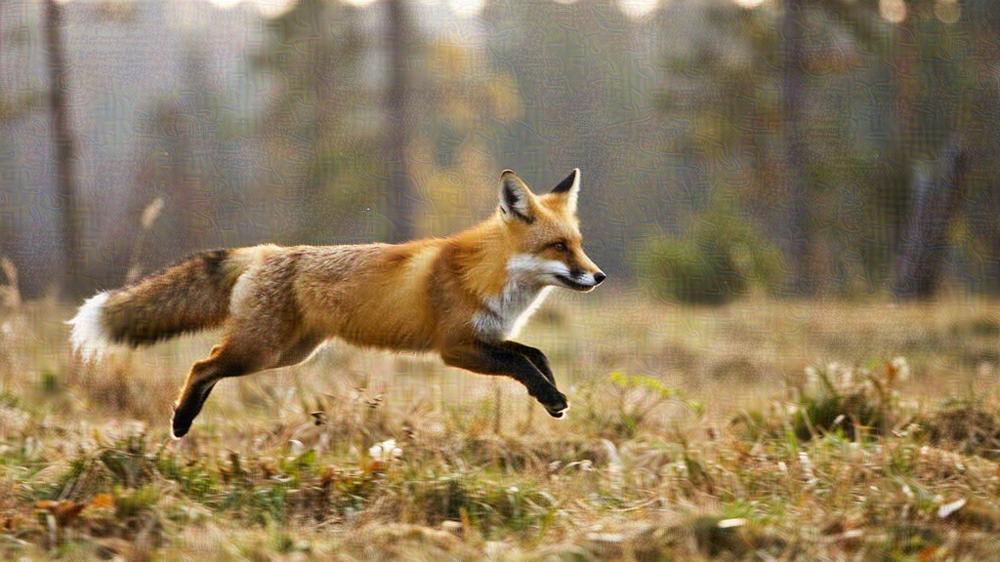
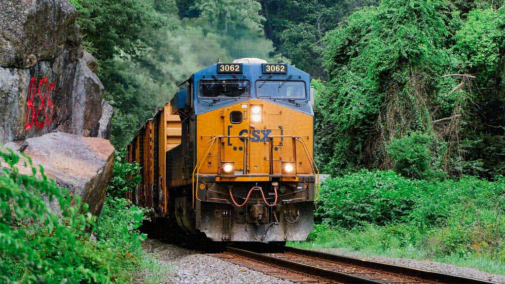
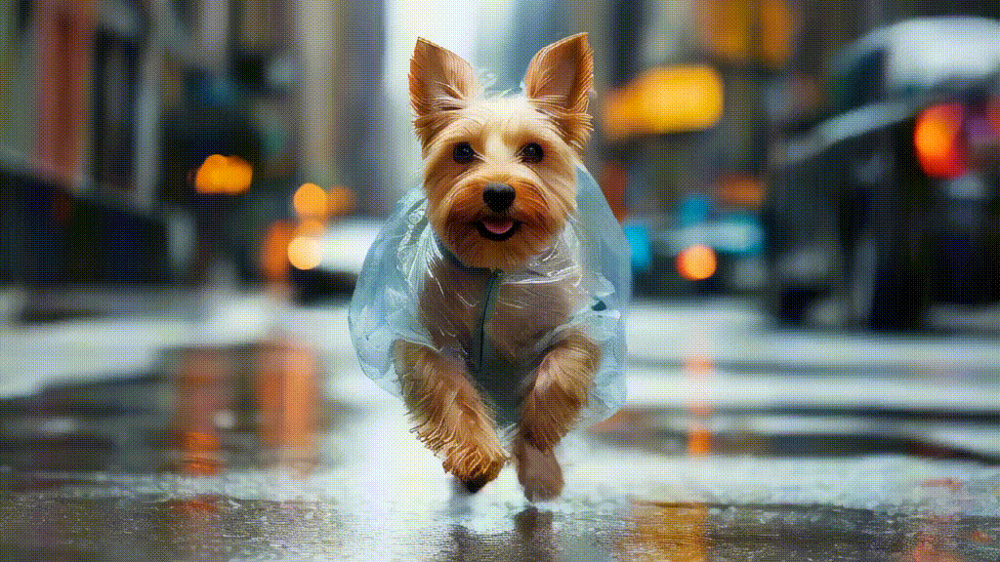
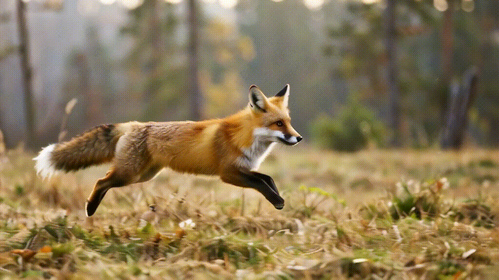
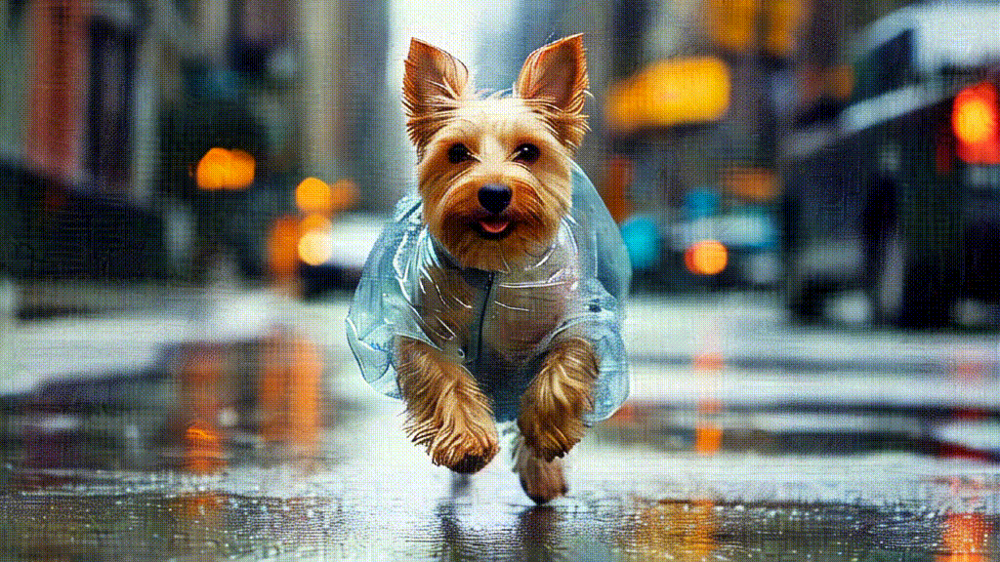
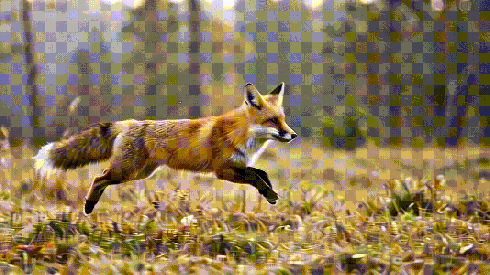
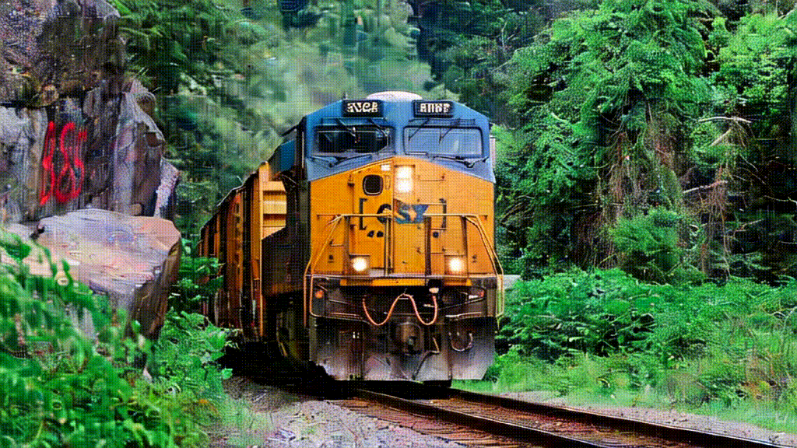

# MEDUSA: Motion Elimination in Diffusion Using Spectral Attack

<p align="center">
  
</p>

<p align="center">
  <a href="#getting-started"><b>Getting Started</b></a> ·
  <a href="#examples"><b>Examples</b></a> ·
  <a href="#citation"><b>Citation</b></a>
</p>

This repository contains the official research code for **MEDUSA: Motion Elimination in Diffusion Using Spectral Attack**. MEDUSA studies adversarial image perturbations for image-to-video diffusion models and implements a spectral attack on the temporal attention structure of **Stable Video Diffusion (SVD)**.

Given a clean input image, MEDUSA optimizes a bounded adversarial perturbation that minimizes the nuclear norm of selected temporal attention matrices. The perturbed image remains visually close to the original input, while the generated video motion can be significantly suppressed or altered.

> **Research use only.** This code is released to support reproducible research on the robustness and safety of generative video models. Please use it responsibly and follow the licenses/terms of the underlying models and datasets.

## News

- Initial open-source release of the core SVD temporal-attention spectral attack.

## Method Overview

MEDUSA attacks the temporal pathway of image-to-video diffusion by directly supervising attention spectra during generation.

1. Load an input image and encode it into SVD's latent space.
2. Hook the Q/K projections of selected temporal self-attention blocks.
3. Reconstruct temporal attention matrices during a denoising step.
4. Minimize the mean nuclear norm of conditional temporal attention matrices.
5. Project the optimized image back into an `L∞` perturbation ball around the clean image.
6. Optionally generate the attacked SVD video from the adversarial image.

The core implementation is split across:

- [`attack/attack.py`](attack/attack.py): command-line attack entry point and optimization loop.
- [`attack/utils/attention.py`](attack/utils/attention.py): temporal attention hooks and nuclear-norm loss.
- [`attack/utils/svd.py`](attack/utils/svd.py): SVD loading, conditioning, denoising, and video generation helpers.
- [`attack/utils/model_parallel.py`](attack/utils/model_parallel.py): automatic multi-GPU model sharding for memory-heavy SVD inference.

## Examples

### Input images and adversarial images

<p align="center">
  
  
  
</p>

<p align="center">
  
  
  
</p>

### Video results

The repository includes compact GIFs for visual inspection. Files ending with `_c.gif` show clean/reference generations and files ending with `_a.gif` show adversarial generations.

<p align="center">
  
  
  
</p>

<p align="center">
  
  
  
</p>

## Getting Started

### Requirements

- Linux is recommended.
- Python `>=3.10`.
- CUDA-enabled PyTorch.
- One or more NVIDIA GPUs. SVD is memory intensive; multi-GPU sharding is supported through `--devices` and `--max_memory`.
- Stable Video Diffusion checkpoint (`svd.safetensors`). Model weights are **not** included in this repository.

### Installation

```bash
git clone git@github.com:medusa-research/medusa.git
cd medusa

python3 -m venv .venv
source .venv/bin/activate

# Choose the PyTorch/CUDA build that matches your machine.
pip3 install torch torchvision torchaudio --index-url https://download.pytorch.org/whl/cu118
pip3 install -r requirements/pt2.txt
pip3 install -e .
```

### Checkpoint preparation

Download the SVD image-to-video checkpoint separately according to the official Stable Video Diffusion release terms, then place it under `checkpoints/`:

```text
checkpoints/svd.safetensors
```

The model path is configured in [`scripts/sampling/configs/svd.yaml`](scripts/sampling/configs/svd.yaml). If needed, edit:

```yaml
model:
  params:
    ckpt_path: checkpoints/svd.safetensors
```

> Note: if your local config uses an absolute path such as `/checkpoints/svd.safetensors`, either update it to the repository-relative path above or place the checkpoint at that absolute path.

## Usage

### Run MEDUSA on the provided example images

```bash
python3 attack/attack.py \
  --input_path assets/examples \
  --attack_image_folder assets/attack \
  --output_folder assets/outputs \
  --model_config scripts/sampling/configs/svd.yaml \
  --devices cuda:0,cuda:1 \
  --iterations 50 \
  --epsilon 0.062745098 \
  --learning_rate 0.02 \
  --target_timestep 4
```

By default, this command saves adversarial images only. Add `--save_video` to also generate adversarial videos:

```bash
python3 attack/attack.py \
  --input_path assets/examples/001.jpg \
  --attack_image_folder assets/attack \
  --output_folder assets/outputs \
  --model_config scripts/sampling/configs/svd.yaml \
  --devices cuda:0,cuda:1 \
  --iterations 50 \
  --save_video
```

### Run on a single image

```bash
python3 attack/attack.py \
  --input_path /path/to/image.png \
  --attack_image_folder outputs/attack \
  --output_folder outputs/videos \
  --model_config scripts/sampling/configs/svd.yaml \
  --devices cuda:0,cuda:1 \
  --max_memory cuda:0=70GiB,cuda:1=70GiB \
  --num_frames 14 \
  --num_steps 25 \
  --iterations 50 \
  --epsilon 0.062745098 \
  --learning_rate 0.02 \
  --target_timestep 4 \
  --save_video
```

### Important arguments

| Argument | Default | Description |
| --- | --- | --- |
| `--input_path` | `assets/examples` | A single image or a directory of `.jpg/.jpeg/.png` images. |
| `--attack_image_folder` | `assets/attack` | Directory for optimized adversarial images. |
| `--output_folder` | `assets/outputs` | Directory for generated adversarial videos when `--save_video` is enabled. |
| `--model_config` | `scripts/sampling/configs/svd.yaml` | SVD model configuration. |
| `--devices` | all visible GPUs | Comma-separated CUDA devices, e.g. `cuda:0,cuda:1`. |
| `--max_memory` | auto-detected | Optional per-device memory caps, e.g. `cuda:0=70GiB,cuda:1=70GiB`. |
| `--iterations` | `50` | Number of projected-gradient attack iterations. |
| `--epsilon` | `16/255` | `L∞` perturbation budget in normalized image space. |
| `--learning_rate` | `0.02` | Step size for signed-gradient updates. |
| `--target_timestep` | `4` | Denoising timestep index used to collect temporal attention. |
| `--save_video` | disabled | Generate and save an SVD video from the adversarial image. |

Outputs are named from the input image stem:

```text
<attack_image_folder>/<image_stem>_adv.png
<output_folder>/<image_stem>_adv.mp4   # only with --save_video
```

## Repository Structure

```text
medusa/
├── attack/
│   ├── attack.py                  # MEDUSA CLI and optimization loop
│   └── utils/
│       ├── attention.py           # temporal attention capture + spectral loss
│       ├── model_parallel.py      # automatic SVD model sharding
│       └── svd.py                 # SVD loading, denoising, conditioning, sampling
├── assets/
│   ├── examples/                  # small example input images
│   ├── attack/                    # example adversarial images
│   ├── outputs/                   # example clean/adversarial GIFs
│   └── medusa-overview-hd.png     # overview figure
├── checkpoints/                   # place SVD checkpoints here; weights are ignored by git
├── requirements/pt2.txt           # Python dependencies
├── scripts/sampling/configs/      # SVD config
└── sgm/                           # Stable Generative Models runtime subset
```

## Notes

- This is a compact open-source subset extracted for the MEDUSA release. Local experiment folders, large generated outputs, private paths, and model checkpoints are intentionally excluded.
- The `sgm/` runtime is derived from Stability AI's generative-models codebase. Please check and preserve the applicable upstream licenses/notices before redistribution.
- Generated outputs and checkpoints should not be committed. The repository `.gitignore` excludes `checkpoints/`, `inputs/`, and `outputs/` by default while keeping the lightweight examples under `assets/`.

## Citation

If you find this project useful, please cite our paper:

```bibtex
@inproceedings{yu2026medusa,
  title     = {MEDUSA: Motion Elimination in Diffusion Using Spectral Attack},
  author    = {Yu, Hongwei and Zha, Daoqing and Ding, Xinlong and Li, Jiawei and Zhuo, Junbao and Liu, Qiankun and Ma, Huimin and Chen, Jiansheng},
  booktitle = {Proceedings of the International Conference on Machine Learning},
  year      = {2026}
}
```

Please also cite Stable Video Diffusion / Stable Generative Models when using the SVD backbone or runtime.

## Acknowledgements

This implementation builds on the Stable Video Diffusion / Stable Generative Models ecosystem. We thank the authors and maintainers of the open-source projects that make this research possible, including PyTorch, xFormers, OpenCLIP, and the broader diffusion-model research community.

## License

This repository is released under the [Apache License 2.0](LICENSE).

The SVD checkpoint and upstream `sgm` components may be governed by separate licenses and model usage terms; please review them carefully before redistribution or commercial use.
