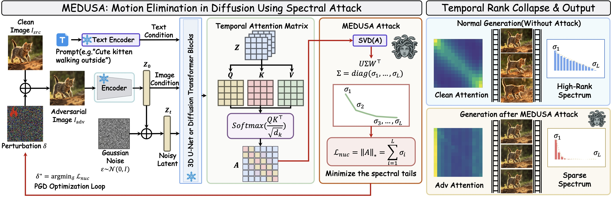

<h1 align="center">MEDUSA: Motion Elimination in Diffusion Using Spectral Attack</h1>

<p align="center">
  <a href="https://daoqingzha.github.io/medusa/">
    
  </a>
  <a href="#">
    
  </a>
</p>

<p align="center">
  <a href="https://scholar.google.com/citations?user=cDidt64AAAAJ">Hongwei Yu</a><sup>*</sup>,
  <a href="https://daoqingzha.site/">Daoqing Zha</a><sup>*</sup>,
  <a href="https://scholar.google.com/citations?user=JY9oXVIAAAAJ">Xinlong Ding</a>,
  <a href="https://scholar.google.com/citations?user=xWy8RZEAAAAJ">Jiawei Li</a>,
  <a href="https://scholar.google.com/citations?user=iBt9uHUAAAAJ">Junbao Zhuo</a>,
  <a href="https://scholar.google.com/citations?user=TNDbzzMAAAAJ">Qiankun Liu</a>,
  <a href="https://scholar.google.com/citations?user=32hwVLEAAAAJ">Huimin Ma</a>,
  <a href="https://scholar.google.com/citations?user=A1gA9XIAAAAJ">Jiansheng Chen</a><sup><a href="mailto:jschen@ustb.edu.cn">✉️</a></sup>
</p>

<p align="center">
  University of Science and Technology Beijing
</p>


<p align="center">
  <b>Proceedings of the International Conference on Machine Learning (ICML) 2026</b>
</p>

<p align="center">
  
</p>

<p align="center">
  <a href="#getting-started"><b>Getting Started</b></a> ·
  <a href="#examples"><b>Examples</b></a> ·
  <a href="#usage"><b>Usage</b></a> ·
  <a href="#citation"><b>Citation</b></a>
</p>

This repository contains the official research code for **MEDUSA: Motion Elimination in Diffusion Using Spectral Attack**. MEDUSA studies adversarial image perturbations for **image-to-video diffusion models** by attacking the spectral structure of temporal attention.

Given a clean input image, MEDUSA optimizes a bounded adversarial perturbation that minimizes the nuclear norm of selected temporal attention matrices. The perturbed image remains visually close to the original input, while the generated video motion can be significantly suppressed or altered.

Our paper studies MEDUSA on multiple image-to-video generation backbones, including **Stable Video Diffusion**, **[DynamiCrafter](https://github.com/Doubiiu/DynamiCrafter)**, and **[LTX-Video](https://github.com/Lightricks/LTX-Video)**. This repository currently releases the compact implementation for the Stable Video Diffusion backend; the attack design is model-agnostic and can be adapted to other video diffusion architectures with temporal attention modules.

> **Research use only.** This code is released to support reproducible research on the robustness and safety of generative video models. Please use it responsibly and follow the licenses/terms of the underlying models and datasets.

## 🔥 News

- 🔥 **2026.06**: We released the code for the MEDUSA spectral attack.
- 🎉 **2026.04**: Our work was accepted by **ICML 2026**.

## 🧠 Method Overview

MEDUSA attacks the temporal pathway of image-to-video diffusion by directly supervising attention spectra during generation.

1. Load an input image and encode it into the target model's latent space.
2. Hook the Q/K projections of selected temporal self-attention blocks.
3. Reconstruct temporal attention matrices during a denoising step.
4. Minimize the mean nuclear norm of conditional temporal attention matrices.
5. Project the optimized image back into an `L∞` perturbation ball around the clean image.
6. Optionally generate the attacked video from the adversarial image.

The released implementation is split across:

- [`attack/attack.py`](attack/attack.py): command-line attack entry point and optimization loop.
- [`attack/utils/attention.py`](attack/utils/attention.py): temporal attention hooks and nuclear-norm loss.
- [`attack/utils/svd.py`](attack/utils/svd.py): backend loading, conditioning, denoising, and video generation helpers for the released SVD implementation.
- [`attack/utils/model_parallel.py`](attack/utils/model_parallel.py): automatic multi-GPU model sharding for memory-heavy video diffusion inference.

## 🖼️ Examples

### Input images and adversarial images

<p align="center">
  
  
  
</p>

<p align="center">
  
  
  
</p>

### Video results

<p align="center">
  
  
  
</p>

<p align="center">
  
  
  
</p>

## 🚀 Getting Started

### Requirements

- Linux is recommended.
- Conda or Miniconda.
- Python `3.10`.
- CUDA-enabled PyTorch. The current development environment uses PyTorch `2.0.1+cu117`, matching the `torch>=2.0.1` requirement in [`requirements/pt2.txt`](requirements/pt2.txt).
- One or more NVIDIA GPUs. Image-to-video diffusion inference is memory intensive; multi-GPU sharding is supported through `--devices` and `--max_memory`.
- Backend model checkpoints are **not** included in this repository. For the released SVD backend, place `svd.safetensors` under `checkpoints/`.

### Installation

```bash
git clone git@github.com:medusa-research/medusa.git
cd medusa

conda create -n medusa python=3.10 -y
conda activate medusa

# PyTorch version used by the current development environment.
pip install torch==2.0.1 torchvision==0.15.2 torchaudio==2.0.2 --index-url https://download.pytorch.org/whl/cu117

pip install -r requirements/pt2.txt
pip install -e .
```

If your CUDA driver/toolkit setup requires another PyTorch build, install the matching PyTorch wheel first, then install the remaining dependencies from `requirements/pt2.txt`.

### Checkpoint preparation

Download the image-to-video model checkpoint separately according to the corresponding model release terms. For the released SVD backend, download the SVD checkpoint from [stabilityai/stable-video-diffusion-img2vid](https://huggingface.co/stabilityai/stable-video-diffusion-img2vid) and place it at:

```text
checkpoints/svd.safetensors
```

The path is configured in [`scripts/sampling/configs/svd.yaml`](scripts/sampling/configs/svd.yaml):

```yaml
model:
  params:
    ckpt_path: checkpoints/svd.safetensors
```

## ⚙️ Usage

### Run MEDUSA on the provided example images

```bash
python3 attack/attack.py \
  --input_path assets/examples \
  --attack_image_folder assets/attack \
  --output_folder assets/outputs \
  --model_config scripts/sampling/configs/svd.yaml \
  --devices cuda:0,cuda:1 \
  --iterations 50 \
  --epsilon 0.062745098 \
  --learning_rate 0.02 \
  --target_timestep 4
```

By default, this command saves adversarial images only. Add `--save_video` to also generate adversarial videos:

```bash
python3 attack/attack.py \
  --input_path assets/examples/001.jpg \
  --attack_image_folder assets/attack \
  --output_folder assets/outputs \
  --model_config scripts/sampling/configs/svd.yaml \
  --devices cuda:0,cuda:1 \
  --iterations 50 \
  --save_video
```

### Important arguments

| Argument | Default | Description |
| --- | --- | --- |
| `--input_path` | `assets/examples` | A single image or a directory of `.jpg/.jpeg/.png` images. |
| `--attack_image_folder` | `assets/attack` | Directory for optimized adversarial images. |
| `--output_folder` | `assets/outputs` | Directory for generated adversarial videos when `--save_video` is enabled. |
| `--model_config` | `scripts/sampling/configs/svd.yaml` | Model configuration for the released backend. |
| `--devices` | all visible GPUs | Comma-separated CUDA devices, e.g. `cuda:0,cuda:1`. |
| `--max_memory` | auto-detected | Optional per-device memory caps, e.g. `cuda:0=70GiB,cuda:1=70GiB`. |
| `--iterations` | `50` | Number of projected-gradient attack iterations. |
| `--epsilon` | `16/255` | `L∞` perturbation budget in normalized image space. |
| `--learning_rate` | `0.02` | Step size for signed-gradient updates. |
| `--target_timestep` | `4` | Denoising timestep index used to collect temporal attention. |
| `--save_video` | disabled | Generate and save a video from the adversarial image. |

Outputs are named from the input image stem:

```text
<attack_image_folder>/<image_stem>_adv.png
<output_folder>/<image_stem>_adv.mp4   # only with --save_video
```

## 📁 Repository Structure

```text
medusa/
├── attack/
│   ├── attack.py                  # MEDUSA CLI and optimization loop
│   └── utils/
│       ├── attention.py           # temporal attention capture + spectral loss
│       ├── model_parallel.py      # automatic model sharding
│       └── svd.py                 # released backend utilities
├── assets/
│   ├── examples/                  # small example input images
│   ├── attack/                    # example adversarial images
│   ├── outputs/                   # example clean/adversarial GIFs
│   └── overview.jpeg              # overview figure
├── checkpoints/                   # place model checkpoints here; weights are ignored by git
├── requirements/pt2.txt           # Python dependencies
├── scripts/sampling/configs/      # backend config
└── sgm/                           # Stable Generative Models runtime subset for the released backend
```

## 📚 Citation

If you find this project useful, please cite our paper:

```bibtex
@inproceedings{yu2026medusa,
  title     = {MEDUSA: Motion Elimination in Diffusion Using Spectral Attack},
  author    = {Yu, Hongwei and Zha, Daoqing and Ding, Xinlong and Li, Jiawei and Zhuo, Junbao and Liu, Qiankun and Ma, Huimin and Chen, Jiansheng},
  booktitle = {Proceedings of the International Conference on Machine Learning},
  year      = {2026}
}
```

Please also cite the corresponding image-to-video backbone when using MEDUSA with Stable Video Diffusion, [DynamiCrafter](https://github.com/Doubiiu/DynamiCrafter), [LTX-Video](https://github.com/Lightricks/LTX-Video), or other video generation models.

## 🙏 Acknowledgements

This work builds on prior image-to-video generation models, including Stable Video Diffusion / Stable Generative Models, [DynamiCrafter](https://github.com/Doubiiu/DynamiCrafter), and [LTX-Video](https://github.com/Lightricks/LTX-Video). We thank the authors for their inspiring work.

This work was supported by the National Natural Science Foundation of China.

## 📄 License

This repository is released under the [Apache License 2.0](LICENSE).

Model checkpoints and upstream components may be governed by separate licenses and model usage terms; please review them carefully before redistribution or commercial use.
